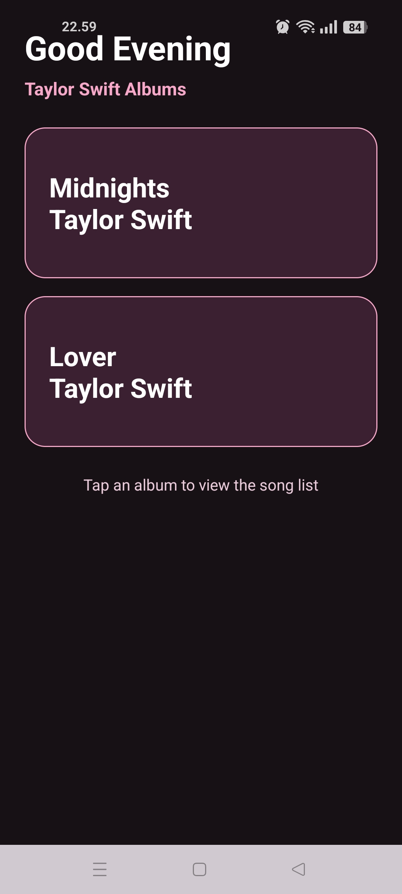
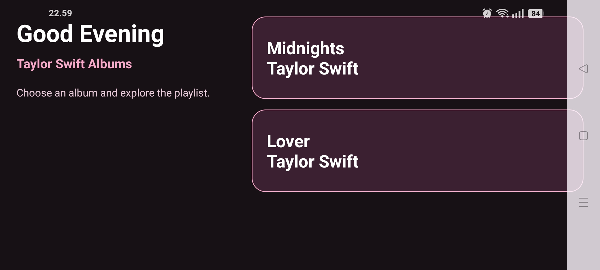
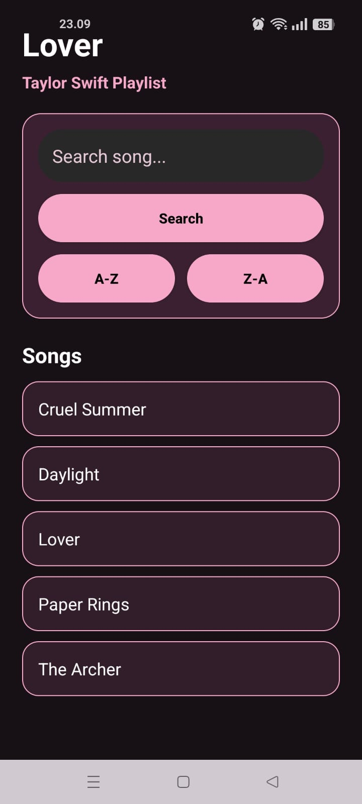
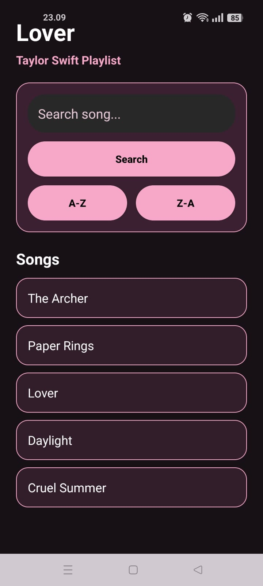
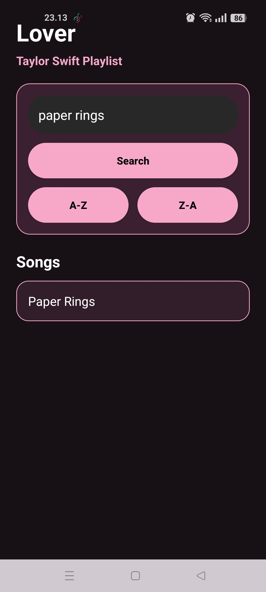
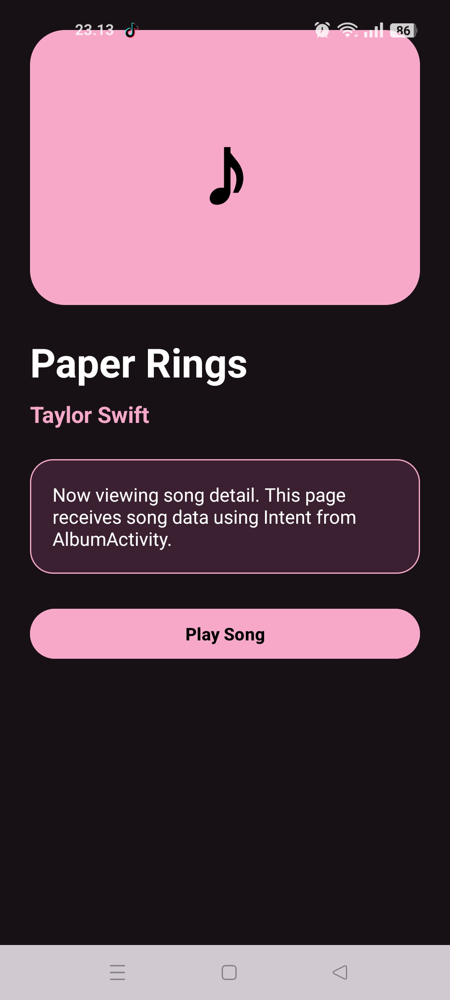
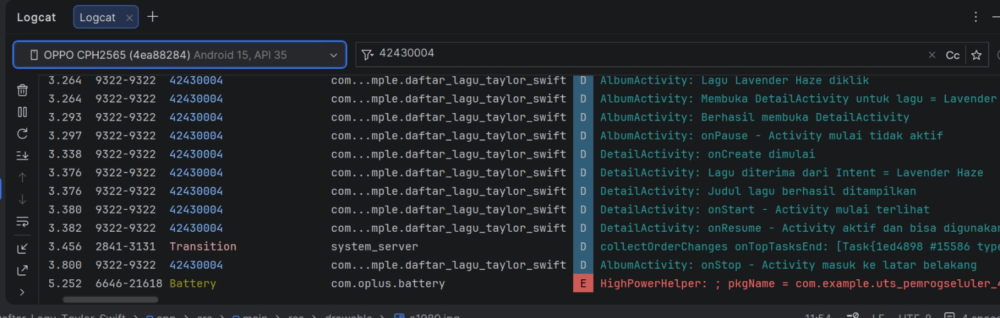

# 🎵 TAYLOR SWIFT ALBUM CATALOG  
✨ Discover • Explore • Listen ✨  


---

## 📌 Identitas

| Keterangan | Data |
|----------|------|
| Nama Lengkap | Dina Ayu Purnami |
| NIM | 42430004 |
| Mata Kuliah | Pemrograman Seluler |
| Topik Aplikasi | Katalog Album dan Lagu Taylor Swift |
| Platform | Android |
| Bahasa | Kotlin + XML |

---

## 📖 Abstract

Aplikasi Taylor Swift Album Catalog merupakan aplikasi berbasis Android yang menampilkan daftar album Taylor Swift beserta daftar lagu di dalamnya. Aplikasi ini dikembangkan menggunakan Kotlin dan XML Layout dengan penyimpanan data sederhana tanpa database eksternal.

Aplikasi menyediakan fitur navigasi antar halaman menggunakan Intent, tampilan daftar album, pencarian lagu, pengurutan data (sorting), serta halaman detail. Selain itu, aplikasi juga mengimplementasikan Logcat untuk debugging dan validasi proses.

**Keywords:** Android, Kotlin, ListView, Intent, Sorting, Search, Logcat.

---

## I. Introduction

Proyek ini dibuat sebagai implementasi UAS mata kuliah Pemrograman Seluler dengan pendekatan Project-Based Learning. Tema yang dipilih adalah katalog album Taylor Swift karena relevan dengan industri musik digital dan menarik untuk dikembangkan menjadi aplikasi mobile interaktif.

Tujuan aplikasi:
- Menampilkan daftar album Taylor Swift  
- Menampilkan daftar lagu dari setiap album  
- Menyediakan fitur pencarian lagu  
- Menyediakan fitur sorting A-Z dan Z-A  
- Mengimplementasikan navigasi antar Activity  
- Menggunakan Logcat untuk debugging  

---

## II. System Design

Aplikasi terdiri dari beberapa halaman utama:

| Halaman | Fungsi |
|--------|--------|
| MainActivity | Halaman awal aplikasi |
| AlbumActivity | Menampilkan daftar album |
| DetailActivity | Menampilkan daftar lagu |

---

## III. Implementation

### A. Data Model

```kotlin
data class Album(
    val nama: String,
    val gambar: Int
)
```

---

### B. Dataset

```kotlin
val listAlbum = listOf(
    Album("Midnights", R.drawable.midnights),
    Album("Lover", R.drawable.lover),
    Album("Folklore", R.drawable.folklore)
)
```

---

### C. Search (Pencarian)

Fitur pencarian dilakukan dengan memfilter data berdasarkan nama lagu.

---

### D. Sorting

- Sort A-Z → urut alfabet naik  
- Sort Z-A → urut alfabet turun  

---

### E. Intent Navigation

```kotlin
val intent = Intent(this, DetailActivity::class.java)
startActivity(intent)
```

---

### F. Logcat

```kotlin
Log.d("42430004", "Aplikasi berjalan")
```

---

## IV. Module Compliance

| Modul | Implementasi |
|------|-------------|
| Modul 2 & 3 | UI layout XML |
| Modul 4 & 5 | Intent navigation |
| Modul 6 | Data List |
| Modul 7 | Sorting |
| Modul 9 | Logcat |

---

## V. User Interface Documentation

### 📱 Tampilan Portrait & Landscape

| Portrait | Landscape |
|---------|----------|
|  |  |

---

### 🔽 Hasil Sorting

| A-Z | Z-A |
|----|-----|
|  |  |

---

### 🔍 Hasil Pencarian



---

### ▶️ Pemutar Lagu



---

### 🧾 Logcat



---

## VI. Testing Result

| No | Test Case | Expected Result | Status |
|----|----------|----------------|--------|
| 1 | Buka aplikasi | Berhasil tampil | ✅ |
| 2 | Masuk album | Berhasil | ✅ |
| 3 | Search lagu | Berhasil | ✅ |
| 4 | Sorting A-Z | Berhasil | ✅ |
| 5 | Sorting Z-A | Berhasil | ✅ |
| 6 | Klik detail | Berhasil | ✅ |
| 7 | Logcat | Tercatat | ✅ |

---

## VII. Project Workflow

| Tahap | Fokus |
|------|------|
| 1 | UI Design |
| 2 | Navigation |
| 3 | Data |
| 4 | Search & Sorting |
| 5 | Debugging |

---

## VIII. How to Run

```bash
git clone https://github.com/dinaypurnami-ship-it/Daftar_Lagu_Taylor_Swift.git
```

Buka di Android Studio → Run

---

## IX. Project Structure

```
Daftar_Lagu_Taylor_Swift/
├── app/
├── tampilanpotrait.jpg
├── tampilanlandscape.jpg
├── az.jpg
├── za.jpg
├── searchlagu.jpg
├── putarlagu.jpg
├── logcat.jpg
└── README.md
```

---

## X. Key Features

✨ Core:
- Daftar album  
- Search lagu  
- Sorting  
- Detail  

🎨 UI:
- Dark theme  
- Responsive  
- Card layout  

---

## XI. Conclusion

Aplikasi berhasil dibuat dengan menerapkan konsep dasar Android seperti Activity, Intent, ListView, serta penggunaan Kotlin dan XML. Fitur pencarian, sorting, dan logging berjalan dengan baik dan sesuai dengan ketentuan UAS.

---
